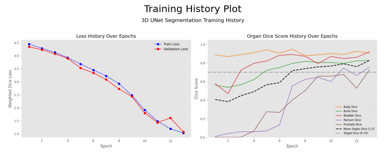
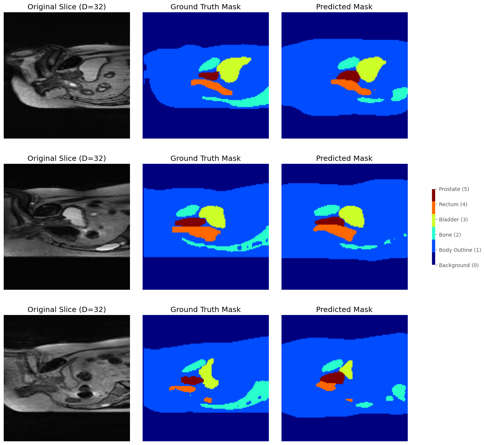
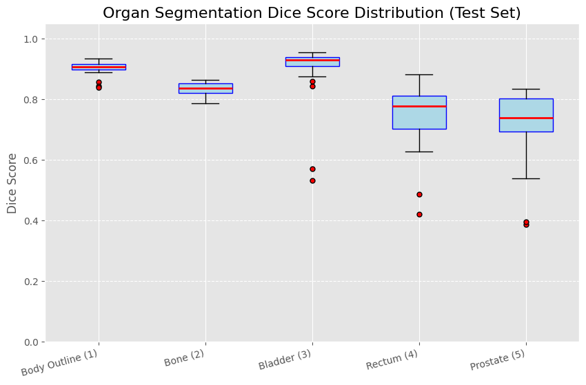
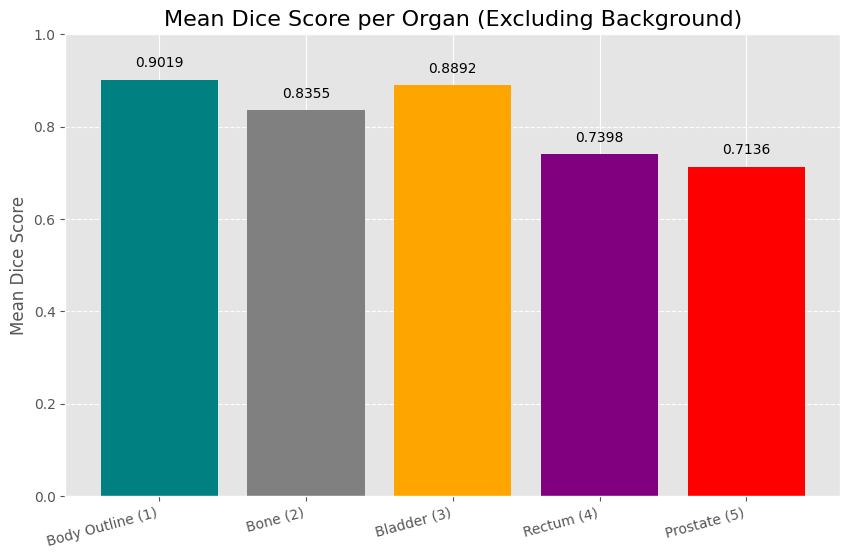

# 3D Medical Volume Segmentation using Improved UNet3D

## 1. Algorithm Description and Problem Solved

### Problem Statement

The accurate and efficient segmentation of anatomical structures in three dimensional medical imaging is important for clinical applications.This report aims to address the challenges of attempting to segment various different organ types located in the pelvic region, which include: prostate gland, rectum, bone, and the body outline from downsampled data obtained from the downsampled 3D NIfTI volumes. The significant class imbalance of organs is deemed true as the target (the prostate) occupies only a small fraction of the total volume of the scans. The main objective of this project is to produce segmentations with high fidelity, highlighting all of the organs with ground and masks, and to further quantify our successes by achieving a a minimum dice similarity coefficient (DSC) of 0.7 for every segmented structure.  

### Algorithm Overview: Improved 3D UNet Architecture

This project uses a modified 3D UNet architecture to tackle the medical volume segmentation of the prostate gland. The network follows a contracting and expanding structure that processes 3D scan data like from an MRI scan. 

On the downsampling path on the 3D UNet architecture implementation, the system gradually increases the models capacity and reduces the spatial dimensions of the input volume while extracting increasingly more and more complex features. This downsampling processes helps capture entire hierarchical features at multiple scales which enables distinguish between multiple organs. The bottleneck layer of the architecture acts like a junction that efficiently transfers this overall information to aid in the reconstruction. 

During the expansion phase in the UNet3D block, the network reconstructs the segmentation map by progressively upsampling the compressed features back to the original dimensions. The architecture for the UNet3D block utilises skip connections, which are shortcuts between corresponding compression and expansion stages which allow the decoder to recover fine spatial details, such as organ edges and textures that would be lost during the downsampling process. This is crucial for accurately outlining organ boundaries, which is essential for clinical use. 

The improvement in our model comes from integrating residual connections. Often times, deep networks can suffer from vanishing gradients, a problem where gradients which are used for updating the network weights become extremely small when they propagate upwards. These connections act as skip routes, which allow the gradients to flow directly through the network. This overall training process enables us to successfully build and train a more complex and capable model.

## 2. Dependencies and Reproducibility

This project is implemented in Python and relies heavily on the PyTorch deep learning framework and complementary scientific libraries to effectively segment the required 3D medical image processing and deep learning workflows. It relies on various key packages in order to fulfil processes such as data loading, model training, pre-processing, and the overall evaluation of the model. 

### Required Dependencies

| Package Name | Minimum Version | Description |
|--------------|-----------------|-------------|
| torch | 2.0.0 | Core deep learning library |
| torchvision | 0.15.0 | For common image/data utilities |
| numpy | 1.23.0 | Fundamental package for scientific computing |
| matplotlib | 3.7.0 | For visualisation and plotting results |
| nibabel | 5.1.0 | For loading and handling NIfTI format medical images |
| tqdm | 4.65.0 | For displaying training progress bars |
| scipy | 1.9.0 | For 3D image resampling and scientific computing |

### Reproducibility of Results

The following steps are critical to ensure that the results are reproducable: 

- **Seed Configuration**: All random seeds for NumPy, PyTorch, and Python's random module must be fixed. 
- **Dataset Integrity**: Use the exact same version of the downsampled Prostate 3D dataset (linked in the Appendix).
- **Model Weights**: The trained model weights (`best_unet3d_model.pth`) must be provided alongside the code as reference to check for consistency between different runs. 
- **Device Consistency**: Training was performed on a NVIDIA A100 on a GPU using CUDA, on Google Collabs. The training time was approximately 40 - 50 minutes, however, results may vary slightly if run on a different GPU or CPU.
- **File Pathing**: As specified previously, the training was done on the Google Collabs which requires the dataset to be uploaded on Google Drives as a zip file. Before the files, a bash script needs to be run to unzip the file and place it in a temporary directory so that the data could be processed faster. These instructions are included in the test_script.md file. To recreate this in a local directory, the file path in dataset.py should be modified to the location of the dataset which is located on line 14: LOCAL_UNZIPPED_BASE_DIR = "/tmp/data_3d". 


## 3. Example Inputs, Traning Outputs, and Plots

### Example Input and Output

The input to the model is a normalised 3D volume, and the output is a multi-class 3D segmentation map.

**Input Example**: A single 3D NIfTI volume of size (depth, height, width) representing the patient's anatomy.

**Output Example**: A 3D segmentation map with the same spatial dimensions, where each organ type is represented by an index between 0 - 5.

### Class Label Mapping

| Class | Label | Description |
|-------|-------|-------------|
| 0 | Background | Non-anatomical regions |
| 1 | Body Outline | External body contour |
| 2 | Bone | Pelvic bone structure |
| 3 | Bladder | Urinary bladder |
| 4 | Rectum | Rectal cavity |
| 5 | Prostate | Prostate gland |

### Training Outputs

```
Using device: cuda

Starting 3D UNet Training...

--- Epoch 01/20 ---
| Train Loss: 4.4482 | Val Loss: 4.3472 | Best Min Organ Dice: 0.0013
| Val Dice (Mean Organs): 0.4072 | Min Organ Dice: 0.0013
--------------------------------------------------
--- Epoch 02/20 ---
| Train Loss: 4.2868 | Val Loss: 4.2305 | Best Min Organ Dice: 0.0013
| Val Dice (Mean Organs): 0.3834 | Min Organ Dice: 0.0001
--------------------------------------------------
--- Epoch 03/20 ---
| Train Loss: 4.1316 | Val Loss: 4.0778 | Best Min Organ Dice: 0.0013
| Val Dice (Mean Organs): 0.4478 | Min Organ Dice: 0.0012
--------------------------------------------------
--- Epoch 04/20 ---
| Train Loss: 3.9307 | Val Loss: 3.9027 | Best Min Organ Dice: 0.0593
| Val Dice (Mean Organs): 0.4907 | Min Organ Dice: 0.0593
--------------------------------------------------
--- Epoch 05/20 ---
| Train Loss: 3.6868 | Val Loss: 3.5296 | Best Min Organ Dice: 0.0707
| Val Dice (Mean Organs): 0.5659 | Min Organ Dice: 0.0707
--------------------------------------------------
--- Epoch 06/20 ---
| Train Loss: 3.4527 | Val Loss: 3.3421 | Best Min Organ Dice: 0.1324
| Val Dice (Mean Organs): 0.5875 | Min Organ Dice: 0.1324
--------------------------------------------------
--- Epoch 07/20 ---
| Train Loss: 3.2282 | Val Loss: 3.0885 | Best Min Organ Dice: 0.4010
| Val Dice (Mean Organs): 0.7176 | Min Organ Dice: 0.4010
--------------------------------------------------
--- Epoch 08/20 ---
| Train Loss: 2.9270 | Val Loss: 2.7249 | Best Min Organ Dice: 0.5023
| Val Dice (Mean Organs): 0.7385 | Min Organ Dice: 0.5023
--------------------------------------------------
--- Epoch 09/20 ---
| Train Loss: 2.4817 | Val Loss: 2.4367 | Best Min Organ Dice: 0.6447
| Val Dice (Mean Organs): 0.7576 | Min Organ Dice: 0.6447
--------------------------------------------------
--- Epoch 10/20 ---
| Train Loss: 1.9159 | Val Loss: 1.8030 | Best Min Organ Dice: 0.6447
| Val Dice (Mean Organs): 0.7665 | Min Organ Dice: 0.6001
--------------------------------------------------
--- Epoch 11/20 ---
| Train Loss: 1.4839 | Val Loss: 1.4346 | Best Min Organ Dice: 0.6763
| Val Dice (Mean Organs): 0.7913 | Min Organ Dice: 0.6763
--------------------------------------------------
--- Epoch 12/20 ---
| Train Loss: 1.1924 | Val Loss: 1.6117 | Best Min Organ Dice: 0.6763
| Val Dice (Mean Organs): 0.7600 | Min Organ Dice: 0.5284
--------------------------------------------------
--- Epoch 13/20 ---
| Train Loss: 1.0364 | Val Loss: 1.0780 | Best Min Organ Dice: 0.7254
| Val Dice (Mean Organs): 0.8266 | Min Organ Dice: 0.7254
--------------------------------------------------

Target achieved! All organ Dice scores are >= 0.70. Stopping training.

Training history plotted and saved to training_history.png

Training complete.

--- Final Test Set Evaluation ---
Loaded best model weights for final testing.
Test Loss: 0.1796
Test Set Minimum Organ Dice (1-5): **0.7136**

Attempting to display training history plot...
```
As we can see here, the number of epochs required to reach our goal of reaching a DSC of 0.7 is 13. 

### Result Visualisations

#### Loss and Metrics During Training

*The two panel metric plot chart shows the model's training process over time. The plot on the left shows both the training and validation loss decreasing as the number of epochs increase. This indicates the model is gradually learning. The plot on the right measures the segmentation accuracy bewteen all of the 5 different organs, where they are all approaching the target dice score of 0.7.*

#### Slice Comparison Between Ground Truth Mask and Predicted

*Side by side comparisons showing the model segmentation through three different scans. Each row in the figure shows the model's segmentation performance on three different scans. The colour coding in the ground truth mask and predicted mask helps to evaluate the model's accuracy in identifying the different organs.*

#### Prostate DSC Distribution

*The Box plot shows the distribution of Dice Similarity Coefficients for all of the different organ classes.*

#### Mean Dice Score per Organ

*The bar chart shows the average DSC achieved for each segmented organ which are ranked by their performance. This highlighting the model's performance on both large and small anatomical structures of the human body. We can see the body outline scored the highest mean dice score and the prostate was the lowest.*

## 4. Pre-processing and Data Splits

### Pre-processing 

Pre-processing is essential to standardise the input data and enhance the model. 

- **NIfTI Loading and Conversion**: Volumes are loaded using the nibabel library, and the raw voxel data is converted to a PyTorch tensor, which is further used or model training. 
- **Resampling and Resizing**: All volumes are resampled and resized to a target dimension which is consistent across all files. This ensures that all inputs have all the same dimensions. 
- **Data Augmentation**: To improve generalisation and robustness, various data augmentation processes are applied during training using the *scipy.ndimage* library. This includes transformations like rotations, and intensity transformations like brightness and gamma adjustments.  

### Data Splits

The dataset is split into three subsets: training, validation, and testing:

| Split | Justification | Ratio |
|-------|---------------|---------------|
| Training Set | The training set is used to teach the model the complex patterns of the organ types between segmentation masks and also the input volume. |80% |
| Validation Set | This set helps us fine tune the model's settings and choose the best version during training. | 10% |
| Testing Set | After training is complete, this training set provides a final, unbiased measure of the model's generalisation. This set is used to report the final DSC score for the organ types.| 10% |

This split prioritises maximising the training data, while maintaining enough samples for the validation and testing sets. The larger training portion (80%) helps the model learn complex anatomical patterns. 

## 5. Conclusion

The implementation of the improved 3D UNet architecture for the segmentation of the Prostate 3D scans successfully met the target dice similarity coefficient of 0.7. The algorithm demonstrated robust segmentation capabilities across the 5 different organs presented, where they all varied in shape and sizes. Initially there were some difficulties in achieving the 0.7 score within an appropriate set number of epoch, however after adjusting the training weightings and introducing improvements in data augmentation procedures, the target goal was met with consistency.

## 6. References

[1] F. Isensee, P. Kickingereder, W. Wick, M. Bendszus, and K. H. Maier-Hein, "Brain Tumor Segmentation and Radiomics Survival Prediction: Contribution to the BRATS 2017 Challenge," 2018, *arXiv:1802.10508*. Accessed: Oct. 31, 2025. [Online]. Available: https://arxiv.org/abs/1802.10508v1

[2] W. Dai, B. Woo, S. Liu, M. Marques, C. B. Engstrom, P. B. Greer, S. Crozier, J. A. Dowling, and S. S. Chandras, "CAN3D: Fast 3D Medical Image Segmentation via Compact Context Aggregation," 2021, arXiv:2109.05443. Accessed: Oct. 31, 2025. [Online]. Available: http://arxiv.org/abs/2109.05443

[3] Google Gemini, "Large language model," Google, 2025. Accessed: Oct. 31, 2025. [Online]. Available: https://gemini.google.com

[4] J. A. Dowling et al., "Pelvic MRI Dataset for Radiation Therapy Planning," Calvary Mater Newcastle Hospital, 2015. Accessed: Oct. 31, 2025. [Online]. Available: doi.org/10.25919/45t8-p065


